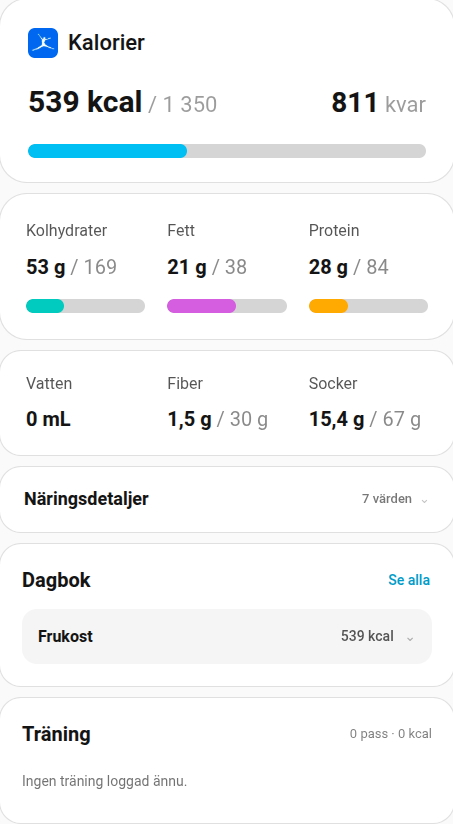
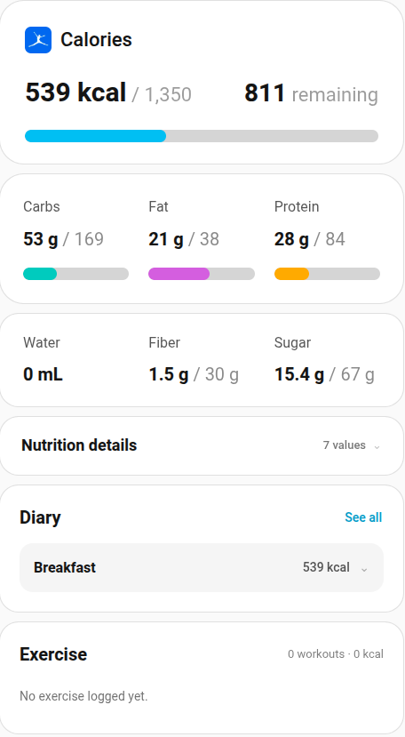

# HA-MyFitnessPal

Read-only Home Assistant integration for MyFitnessPal, providing today's nutrition diary, macros, nutrient goals and exercise data via MyFitnessPal's native mobile API.

> [!IMPORTANT]
> This is an unofficial, experimental integration. It is not affiliated with or endorsed by MyFitnessPal. The underlying mobile API is not officially published and may change without notice.

## Features

- Read-only access to today's MyFitnessPal food diary.
- Daily totals for calories, carbohydrates, protein, fat, fiber and sugar.
- Optional secondary nutrient sensors without additional API traffic.
- Read-only daily water intake in milliliters.
- Read-only exercise diary with separate exercise totals and partner calorie-adjustment metadata.
- Preserves the distinction between a nutrient that is explicitly `0` and a nutrient that MyFitnessPal did not provide.
- Reads MyFitnessPal nutrient goals and exposes goal, remaining amount and percentage of goal when available.
- Exposes a normalized nutrition diary sensor with individual food entries, serving information, nutrients, totals, goals and water intake.
- Normalizes cardio and strength exercise entries without counting Garmin Connect calorie-adjustment entries as workouts.
- Bundles a first-party Lovelace dashboard card during the 0.4.0 beta cycle.
- Polls every 15 minutes.
- Swedish and English entity/config-flow translations.
- Password is used only during initial login or reauthentication and is not stored by the integration.
- Refresh-token authentication is used for subsequent updates.
- No food, weight, exercise, water or goal write methods are called.

## Sensors

The integration enables these sensors by default:

- Calories
- Carbohydrates
- Protein
- Fat
- Fiber
- Sugar
- Water
- Nutrition diary
- Exercise calories
- Exercise duration
- Exercise diary

The following secondary nutrient sensors are created but disabled by default. Enable the ones you want from the MyFitnessPal device/entity page in Home Assistant:

- Saturated fat
- Polyunsaturated fat
- Monounsaturated fat
- Trans fat
- Cholesterol
- Sodium
- Potassium
- Added sugars

These secondary sensors reuse the diary data already fetched by the coordinator and therefore add no extra MyFitnessPal API requests. If MyFitnessPal does not provide a particular nutrient for the foods logged that day, the corresponding sensor remains unavailable/unknown rather than pretending the value is zero.

The **Nutrition diary** sensor exposes today's normalized food entries as attributes, including meal, food name, brand, servings, serving size and nutrients. It also exposes daily totals, effective goals, remaining amounts and `water_ml`.

The **Exercise diary** sensor exposes today's normalized real exercise entries separately from MyFitnessPal partner calorie adjustments. Its state is the number of real exercise entries, not the number of raw `exercise_entry` objects returned by MyFitnessPal. Garmin Connect calorie-adjustment entries are therefore preserved as metadata but excluded from exercise count, duration and calorie totals.

Cardio entries can include duration, calories, start time, METS and optional heart-rate values. Tested strength entries include sets, reps per set, total reps and weight. Strength weight is normalized internally to kilograms while the raw MyFitnessPal value/unit is preserved in the diary metadata. In the tested account MyFitnessPal returned strength weight in pounds even though the app was configured metrically.

Exercise polling adds one additional MyFitnessPal diary request per coordinator update. It is fail-soft: if the exercise endpoint fails while the nutrition endpoints still work, the nutrition entities continue updating and the exercise entities become unavailable instead of reporting false zero values.

## Lovelace dashboard

The repository includes read-only Lovelace examples inspired by the information hierarchy in the MyFitnessPal app while remaining Home Assistant-native.

### First-party HA-MyFitnessPal card

Starting with the 0.4.0 beta development cycle, the integration bundles its own Lovelace Web Component. The integration serves and loads the JavaScript automatically, so the first-party card does not require `custom:button-card` or a manually added Lovelace resource.

As of `0.4.0-beta.6`, the first-party card contains the complete dashboard flow:

- Calories with consumed amount, goal, remaining amount and progress bar
- subtle MyFitnessPal branding using the bundled `icon.png`
- Carbohydrates, Fat and Protein with individual goal progress bars
- compact Water / Fiber / Sugar row
- dynamic Nutrition details that only show secondary nutrients MyFitnessPal actually supplied
- Nutrition details collapsed by default, with a compact summary showing how many secondary nutrient values are available
- collapsed meal rows showing meal name and calories
- click-to-expand food details for each meal
- working **See all / Se alla** and **Hide all / Dölj alla** controls
- collapsed cardio and strength workout rows
- click-to-expand exercise details
- strength summaries with sets, reps and weight
- weight display following Home Assistant's configured mass unit
- missing optional heart-rate values remain hidden instead of being shown as false zero values

The card uses the **Nutrition diary** sensor as the single nutrition data source. The **Exercise diary** sensor is the only additional entity needed when the training section is enabled.

Example:

```yaml
type: custom:ha-myfitnesspal-card
nutrition_entity: sensor.myfitnesspal_naringsdagbok
exercise_entity: sensor.ovrigt_myfitnesspal_traningsdagbok
language: sv
show_training: true
```

`show_nutrition_details: false` can be used to hide the dynamic secondary nutrient section entirely. When enabled, the section is present but starts collapsed for a more compact overview. Entity IDs can differ between installations, so configure the actual entities created by Home Assistant.

See [`examples/lovelace-ha-myfitnesspal-card.yaml`](examples/lovelace-ha-myfitnesspal-card.yaml) for the development example.

### Original YAML examples

The older YAML examples remain in the repository as references and provide:

- a calorie card with consumed, goal, remaining and progress bar
- carbohydrates, fat and protein with individual goal progress bars
- a compact Water / Fiber / Sugar row
- a dynamic Nutrition details card for secondary nutrients such as saturated fat, cholesterol and sodium
- a diary card grouped by meal with food entries and calories

Both original examples use the **Nutrition diary sensor as the single data source**. They currently require [`custom:button-card`](https://github.com/custom-cards/button-card).

- Swedish: [`examples/lovelace-mfp-dashboard.yaml`](examples/lovelace-mfp-dashboard.yaml)
- English: [`examples/lovelace-mfp-dashboard_en.yaml`](examples/lovelace-mfp-dashboard_en.yaml)

They intentionally do **not** include food logging controls because this integration is read-only.

### Screenshots

| Swedish | English |
| --- | --- |
|  |  |

The screenshots currently show the earlier YAML dashboard and will be refreshed as the first-party card UI stabilizes.

## Installation

### Manual installation

1. Copy `custom_components/myfitnesspal` from this repository to:

   ```text
   /config/custom_components/myfitnesspal
   ```

2. Restart Home Assistant.
3. Open **Settings → Devices & services → Add integration**.
4. Search for **MyFitnessPal**.
5. Enter your MyFitnessPal email/username and password.

The password is used for the initial authentication exchange only and is not saved in the Home Assistant config entry. The integration stores the returned refresh token and MyFitnessPal domain user ID so it can renew access without repeatedly using your password.

## Read-only design

This project intentionally treats MyFitnessPal as the place where nutrition and exercise data is entered and Home Assistant as a read-only consumer.

The integration currently reads:

- food diary entries
- nutrient totals
- nutrient goals
- water intake
- exercise diary entries
- partner calorie-adjustment metadata returned with the exercise diary

The pinned upstream client can also read weight measurements, but HA-MyFitnessPal does not poll that endpoint yet. Multi-day reports are intentionally treated carefully because the upstream helper performs one diary request per day rather than using a server-side report endpoint.

See [`docs/read-only-api-scope.md`](docs/read-only-api-scope.md) for the current API map and likely next development steps.

It does **not** expose Home Assistant services or entities for writing data back to MyFitnessPal.

## Dependency

This integration uses [`Rift-Walker/mfp-api`](https://github.com/Rift-Walker/mfp-api), pinned to commit:

```text
89b61eb5bee9062e62ccc98101b1c5527e5c0775
```

Pinning the dependency keeps the Home Assistant integration on a known, tested API-client revision until an update is deliberately made.

## Credits

A major credit goes to **Nathan Walker / Rift-Walker**, creator of [`mfp-api`](https://github.com/Rift-Walker/mfp-api).

`mfp-api` provides the authentication and native MyFitnessPal mobile-API client that makes this Home Assistant integration possible. The upstream project reverse-engineered the API used by the official MyFitnessPal mobile app and documents the relevant REST endpoints and authentication flow.

`mfp-api` is distributed under the MIT License. See the [upstream license](https://github.com/Rift-Walker/mfp-api/blob/main/LICENSE) for details.

## Privacy and security

- Your MyFitnessPal password is not persisted by this integration.
- Home Assistant stores the refresh token in the config entry, like other integration credentials/tokens.
- Nutrition and exercise data is fetched directly from MyFitnessPal by your Home Assistant instance.
- This project does not run a proxy, relay or external cloud service of its own.

## Development workflow

- `main` tracks the current tested/stable version.
- `dev` is used for active development and UI experiments before promotion to `main`.
- Before a prerelease is tagged, manifest version wiring and frontend JavaScript syntax are validated by the `Release sanity` GitHub Actions workflow.
- Release order is: finish code → bump version/cache wiring → verify the green sanity check → create the GitHub tag/release.

## Current status

Current stable version on `main`: **0.3.0**

Current development version on `dev`: **0.4.0-beta.6**

The 0.4.0 beta adds read-only exercise diary support and is now testing the complete bundled first-party Lovelace dashboard before promotion to a stable release.

This is early-stage software built against an unofficial API. Expect changes while the integration is tested and expanded.

## License

HA-MyFitnessPal is released under the MIT License. See [`LICENSE`](LICENSE).